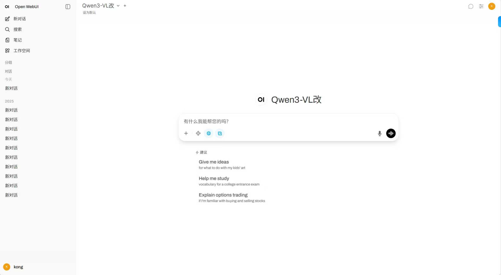

# LLM-Aided Multisensor Fusion Localization

大语言模型辅助的多传感器融合组合定位系统

本仓库整理了同济大学一项视觉大语言模型辅助车辆多传感器融合定位的研究材料与代码。系统利用车载摄像头图像理解当前行驶环境，预测 GNSS、IMU 等传感器在该场景下的信号质量，并据此动态调整融合权重，以提升隧道、雨雾、夜间等退化场景中的定位鲁棒性。

核心链路：**环境感知 → 信号质量预测 → 融合权重自适应**。

## 方法概要

1. **视觉语言模型**  
   本地部署 Qwen3-VL（Docker Desktop + Open WebUI），对驾驶图像做语义解析（光照、道路类型、天气等），并将自然语言输出编码为后续融合模块可用的量化特征。

2. **多传感器融合**  
   以 IMU 机械编排为高频推算核心，GNSS 松组合提供全局位置与速度约束，Camera（MSCKF）提供局部视觉约束，基于卡尔曼滤波进行自适应加权融合。

3. **语义辅助**  
   在原有基于卫星数、PDOP、IMU 零偏等指标的权重逻辑上，引入大模型给出的环境先验，对复杂场景下的传感器可靠性做前瞻性调整。GNSS 失锁时可将对应权重置零，改以 Camera + IMU 维持连续定位。

团队验证表明，在 GNSS 失效等典型复杂场景中，引入语义辅助后定位误差较原开源融合算法降低 30% 以上。

<p align="center">
  
</p>
<p align="center"><em>本地 Open WebUI 部署 Qwen3-VL</em></p>

## 仓库结构

| 路径 | 说明 |
| --- | --- |
| `大语言模型辅助的多传感器融合组合定位系统研究_结题报告.docx` | 结题报告 |
| `中期答辩PPT.pptx` | 中期答辩材料 |
| `结题答辩PPT 大语言模型辅助的多传感器融合组合定位系统研究.pptx` | 结题答辩材料 |
| `sitp结题证书.pdf` | 结题证书 |
| `多传感器融合定位代码/Multi_Sensor_Fusion-dev/` | GNSS / IMU / Camera 融合定位代码 |
| `sitp相关图片/` | 部署、仿真、数据集与视频转帧过程材料 |

## 多传感器融合代码

融合定位程序基于 [2013fangwentao/Multi_Sensor_Fusion](https://github.com/2013fangwentao/Multi_Sensor_Fusion)（GPL-3.0），支持：

- GNSS / INS 松组合解算
- GNSS / INS / Camera 融合解算
- 纯惯导推算
- VIO 解算（需 GNSS 数据完成全局初始化）

### 依赖

- glog
- Eigen
- OpenCV 3.4
- Ceres 1.14.0

### 编译与运行

原工程通过 submodule 挂载 `tools`。本仓库未包含该子模块，编译前请从上游仓库补齐：

```bash
cd 多传感器融合定位代码/Multi_Sensor_Fusion-dev
git submodule init
git submodule update
# 若 submodule 地址不可用，可从上游仓库拷贝 submodules/tools
```

```bash
mkdir build && cd build
cmake .. && make -j3
```

```bash
./mscnav_bin ${configure_file} ${log_dir}
```

更完整的代码说明见 [`多传感器融合定位代码/Multi_Sensor_Fusion-dev/README.md`](多传感器融合定位代码/Multi_Sensor_Fusion-dev/README.md)。

## 团队

- 朱俞彤（汽车与能源学院，车辆工程）
- 齐颖（计算机科学与技术学院，软件工程）
- 李欣鸿（计算机科学与技术学院，软件工程）
- 罗烯尹（电子与信息工程学院，通信工程）
- 指导教师：高乐天（汽车与能源学院）

## 致谢

- 方文涛，[Multi_Sensor_Fusion](https://github.com/2013fangwentao/Multi_Sensor_Fusion)，武汉大学
- 方文涛. 大气增强 PPP/MEMS 惯导/视觉里程计融合定位研究[D]. 武汉大学, 2020.
- Qwen3-VL
